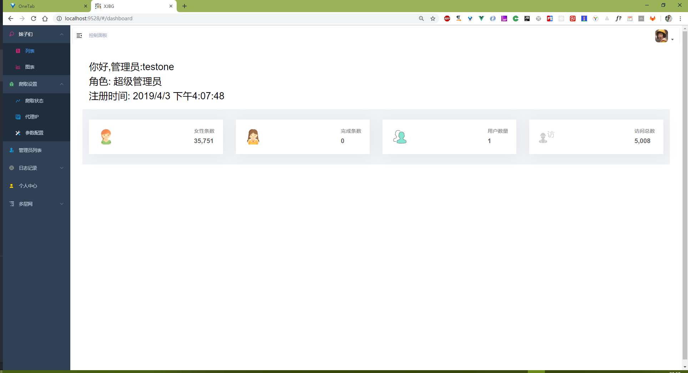
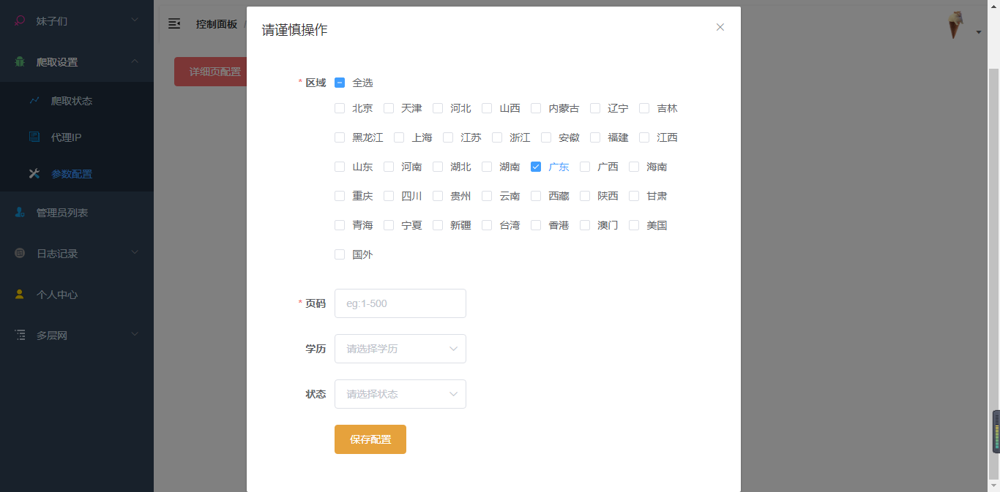
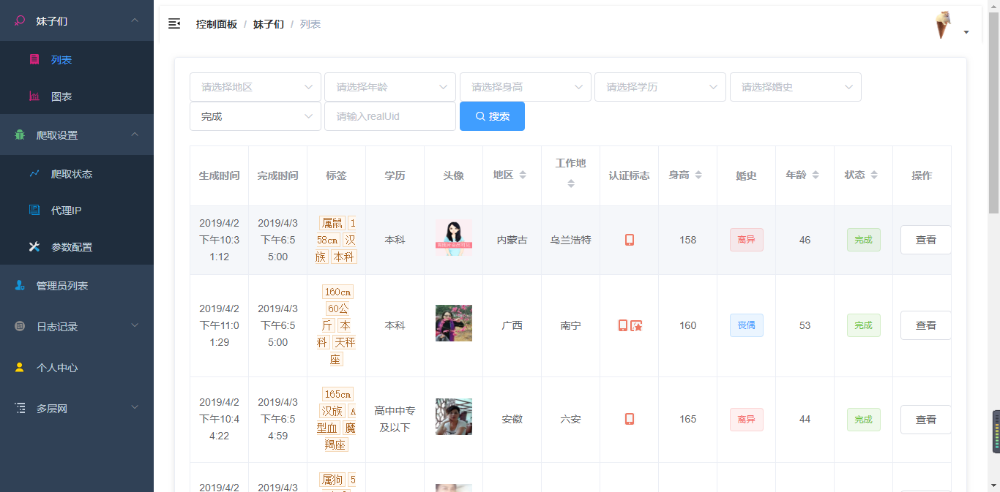

# 感谢开源

闲暇时间XJBG的一个项目，一个下午突发奇想想看看相亲网上的妹子，于是这个项目诞生了。整个项目暂时分为两个部分，后台管理系统，数据服务端。Vue技术栈的管理系统，express的数据服务端，基于node的爬虫，利用pm2和nginx 进行运维。

**欢迎Star✨✨**

**个人的力量是渺小的，希望众人拾材火焰高，如有问题请直接在 Issues 中提，或者您发现问题并有非常好的解决方案，欢迎 PR 👍**

1.1.0- [后台管理页线上地址: http://girl.xutianshi.top/admin/index.html](http://girl.xutianshi.top/admin/index.html)

**<font color="red">移动端、搁置ing还不想做</font>** 0.0.1- [移动端线上地址: http://girl.xutianshi.top/](http://girl.xutianshi.top/)

## 运行

本地运行需要安装有MongoDB

```bash
# 克隆项目
git clone https://github.com/Xu-Angel/Girl.git

# 开启MongoBD
# 进入server文件夹安装依赖包开启调试（必须）
npm i
npm run dev

# 进入admin文件夹安装依赖包开启调试（必须）
npm i
npm run dev

# 移动端开启 进入app文件夹安装依赖包开启调试(可选)
npm i
npm run start
```

**注意**  管理员注册默认是普通管理员，需要数据库更改role字段，重新登录系统才可以使用爬取功能

## 部分截图

### 进入系统


### 参数配置

**进行配置参数后就可以点击开始爬取**



### 列表展示


## 技术栈

nodejs + express + mongodb + mongoose + es6/7 + vue + element-ui

## 已实现功能

- 后台功能
  - [x] 妹子列表✨✨
    - [x] 默认展示
    - [x] 展示规则
    - [x] 整表展示
    - [x] 根据登录IP显示
    - [x] 设置权重值
  - [x] 妹子详情
    - [x] 列表小图,点击看大图
    - [x] 返回上次列表
  - [x] 筛选
    - [x] 根据关键字如年龄、收入、属相、地区
  - [x] 用户
    - [x] 登录、注册
    - [x] 用户中心
  - [x] 权限验证
    - [x] 路由权限
    - [x] 按钮权限
    - [x] 超级管理员
  - [x] 图片上传

- 移动端功能
  - [x] 列表展示
  - [x] 详情展示

- 服务端功能
  - [x] 代理IP爬取、使用、导出、导入
  - [x] 爬取关键字、cookie可配置化
  - [x] 界面化爬取
  - [x] 爬取状态实时展示
  - [x] 定时爬取任务
    - [x] 定时爬取女性数据
    - [x] 每20分钟更新IP池
    - [x] 每30分钟检查IP池
    - [x] 每日设置一次权重
  - [x] 日志类
    - [x] 访问日志
    - [x] 日志文件
    - [x] 运行日志

- 服务器端功能
  - [x] 部署上线
  - [x] nginx代理

### 表设计>: [model](./model.md)

### 数据返回格式

- status *
  - 100 参数错误，需重新填写
  - 101 参数正常，但数据有误
  - 200 响应成功，且数据操作正常
  - 400 程序运行错误，系统捕获错误
- data *
- message

### api文档>: [api文档](./api.md)

## 项目布局

```bash
|-- admin                          后台操作页
    |-- build                      webpack构建
    |   |-- build.js
    |   |-- webpack.prod.conf.js
    |-- config                      运行配置
    |   |-- dev.env.js              开发配置
    |   |-- prod.env.js             生产配置
    |-- dist                        静态资源打包目录
    |-- mock                        mock数据
    |-- src                         源码目录
    |   |-- permission.js           权限文件
    |   |-- api                     接口
    |   |   |-- login.js
    |   |-- assets                  资源文件
    |   |-- components              全局组件
    |   |   |-- Breadcrumb
    |   |-- icons
    |   |-- router                  Vue-router
    |   |   |-- index.js
    |   |-- store                   Vuex
    |   |   |-- getters.js
    |   |   |-- index.js
    |   |   |-- modules
    |   |       |-- app.js
    |   |       |-- user.js
    |   |-- styles                 全局样式
    |   |   |-- element-ui.scss
    |   |-- utils                  工具集
    |   |   |-- auth.js
    |   |-- views                   页面文件夹
    |       |-- detail              页面
    |       |-- layout              布局
    |       |   |-- Layout.vue
    |       |   |-- components
    |-- static                      静态资源
        |-- .gitkeep
|-- server                          数据服务端
    |-- config                      运行配置
    |   |-- default.js              默认配置
    |   |-- development.js          开发配置
    |-- controller                  处理中心，负责路由及数据库的具体操作
    |   |-- admin.js
    |   |-- basePrototype.js
    |   |-- girl.js
    |   |-- spider.js
    |-- core                        爬虫脚本
    |   |-- schedule.js
    |-- db                          JSON文件存放处
    |-- getGirls                    爬虫草稿
    |-- logs                        日志文件夹
    ├── middleware                  中间件
    │   ├── check.js                权限验证
    │   └── statistic.js            API数据统计
    |-- model
    |   |-- admins.js               管理员模型
    |   |-- allgirsl.js             脏模型
    |   |-- details.js              用户详情模型
    |   |-- index.js
    |-- mongodb                     连接数据库
    |   |-- db.js
    |-- public                      静态资源目录
    |-- routes                      路由配置
    |-- socket                      socket
|-- app                          移动端
|-- screenshot                   截图

```

## 版本

v1.0.0

- 配置化开启任务
- 脚本状态展示
- IP爬取
- 列表页展示搜索
- 详情页数据展示，查看
- 管理员管理、信息更改
- 图片上传
- 登录注册
- pm2 + nginx 运维
- 部署上线

v1.1.0

- 标签导航
- 增加定时任务脚本
- 新增IP池状态展示
- 构建IP池进行代理
- 路由、系统日志列表
- 日志文件查看
- 修改列表展示
- 个性化默认头像
- 详细页图片放大优化

v1.1.1

- 增加权重（受欢迎度）
- 定时检查IP脚本
- 根据用户登录地进行显示数据
- 搭建移动端app 0.0.1版本

## License

[MIT](./LICENSE) license.

Copyright (c) 2019-present Xu-Angel
